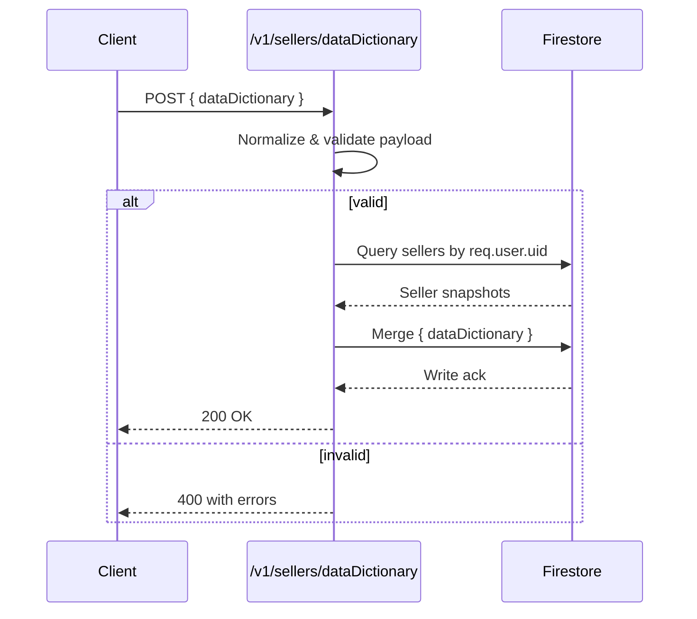
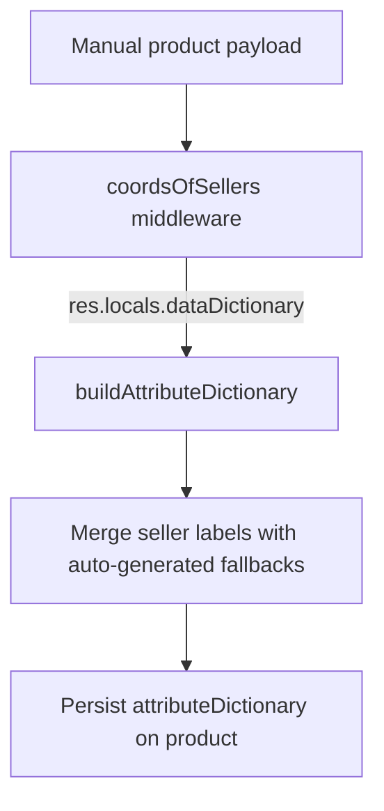

# Seller Data Dictionary Flow

This document explains how the seller data dictionary that is sent by the front-end is validated, persisted and later consumed by the manual product upload pipeline. The implementation was introduced in commit `Add seller data dictionary route and integration` and touches four main areas of the codebase.

## 1. Validation schema (`functions/schemas/sellerDataDictionary.js`)

*Purpose*: normalize the payload so each entry always exposes both `descripcion` and `description` strings.

*Highlights*:
- Accepts either a raw string or an object with `descripcion`/`description` properties for each field (for example `car_make`, `color_options`, etc.).
- Trims the provided value and rejects empty strings to prevent persisting blank labels.
- Normalizes the value by returning an object with both `descripcion` and `description` filled, which simplifies downstream consumption.

```mermaid
flowchart LR
    A[Incoming value] -->|string| B{non-empty?}
    B -->|yes| C[Return { descripcion, description }]
    B -->|no| D[Validation error]
    A -->|object| E{has descripcion or description?}
    E -->|yes| C
    E -->|no| D
```

## 2. Seller endpoint (`functions/handlers/sellers/sellers.js`)

*Purpose*: allow an authenticated seller to persist the dictionary on their Firestore document.

*Highlights*:
- The handler `updateDataDictionary` looks for the payload either under `req.body.dataDictionary` or directly in the request body, which lets the client choose the wrapper format.
- Handles the legacy `id_from_selller` typo by copying it into `id_from_seller` before validation so existing clients do not break.
- Validates the payload with the schema above; if the schema rejects the request a `400` is returned with the validation details.
- Resolves the seller document by `admin.userId == req.user.uid`, then merges the normalized dictionary under the `dataDictionary` field for every matching seller document.



## 3. Middleware propagation (`functions/utilities/middlewares/coordsOfSellers.js`)

*Purpose*: expose the seller dictionary to any downstream product route that relies on seller context.

*Highlights*:
- When the middleware fetches the seller document it now stores `sellerDoc.dataDictionary || {}` in `res.locals.dataDictionary`.
- Product handlers (see next section) can read the dictionary from `res.locals` without needing another Firestore query.

## 4. Manual product upload (`functions/handlers/products/postProductManual.js`)

*Purpose*: reuse the seller dictionary when a manual product is uploaded so attribute labels remain consistent.

*Highlights*:
- `buildAttributeDictionary` walks each field present in the product, looks for a custom label inside `res.locals.dataDictionary`, and only falls back to a humanized version of the field name (e.g. `color_options` → `Color Options`) when the seller has not defined a value.
- The resulting dictionary is persisted inside the product document (`product.attributeDictionary`) together with the generated copy (`product.activeParagraph`) and keywords.
- Array fields like `color_options` or `pics` are joined into comma-separated strings before passing them to the LLM prompt so the language model receives a readable summary.



## End-to-end data usage

1. **Seller updates dictionary**: `POST /v1/sellers/dataDictionary` with the structure described in the user prompt.
2. **Dictionary is stored**: The seller document gains/updates the `dataDictionary` field, containing normalized objects per attribute.
3. **Manual product upload**: When calling `POST /v1/showroom/:showRoomId/seller/:sellerId/products/manual`, the middleware populates `res.locals.dataDictionary` with the seller’s stored values.
4. **Product persistence**: The manual product handler merges the dictionary into the product payload so downstream consumers (UI, analytics, etc.) can render seller-specific labels consistently.

This chain means that once a seller provides their preferred descriptions (e.g. localized explanations or internal naming) the manual product creation flow reuses them automatically without additional configuration.
